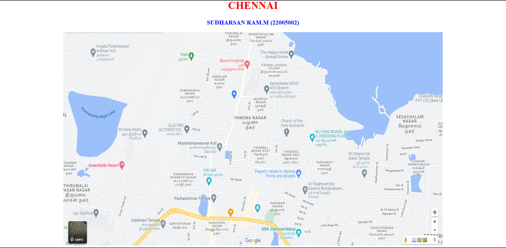

# Places Around Me
## AIM:
To develop a website to display details about the places around my house.

## Design Steps:

### Step 1:
Clone the github repository into Theia IDE.

### Step 2:
Create a new Django project

### Step 3:
Write the needed html code.

### Step 4:
Run the Django server and execute the HTML files.

## Code:
```
map.html

<!DOCTYPE html>
<html lang="en">
<head>
<title>My City</title>
</head>
<body>
<h1 align="center">
<font color="red"><b>CHENNAI</b></font>
</h1>
<h3 align="center">
<font color="blue"><b>SUDHARSAN RAM.M (22005002)</b></font>
</h3>
<center>

<map name="MyCity">
<area shape="circle" coords="290,570,50" href="/static/html/gfr.html" title="Green Fields Resort">
<area shape="circle" coords="910,140,40" href="/static/html/hospital.html" title="Boomi Hospital">
<area shape="circle" coords="160,370,100" href="/static/html/lake.html" title=" Poompozhil Nagar Lake">
<area shape="circle" coords="720,640,20" href="/static/html/hall.html" title="V.N HALL">
<area shape="circle" coords="630,100,90" href="/static/html/park.html" title="Park">
</map>
</center>
</body>
</html>

gfr.html


<!DOCTYPE html>
<html lang="en">
<head>
<title> Green Fields Resort </title>
</head>
<body bgcolor="pink">
<h1 align="center">
<font color="red"><b>CHENNAI </b></font>
</h1>
<h3 align="center">
<font color="blue"><b> Green Fields Resort </b></font>
</h3>
<hr size="3" color="red">
<p align="justify">
<font face="Arial" size="5">
<b>
The Green Fields Resort located in Thirumullaivoyal, Chennai has Banquet Halls, Wedding Lawns, Party Halls, Party Plots, Marriage Halls. Conference Hall can accomodate upto 60 guests in seating and 100 guests in floating. Lawn can accomodate upto 1000 guests in seating and 1500 guests in floating.
Vegetarian and Non Vegetarian food is served at this venue. Features of this wedding venues are : Food provided by the venue, Outside food/caterer allowed at the venue, Non-Veg allowed at the venue, Halls are air Conditioned, Ample parking, Baarat allowed, Fire crackers allowed, Hawan allowed, Overnight wedding allowed, Decor provided by the venue, Packages starts at Rs 250 per plate for vegetarian menu and at Rs 350 for non veg menu.
</b>
</font>
</p>
</body>
</html>

hall.html

<!DOCTYPE html>
<html lang="en">
<head>
<title>V.N HALL </title>
</head>
<body bgcolor="cyan">
<h1 align="center">
<font color="red"><b>CHENNAI</b></font>
</h1>
<h3 align="center">
<font color="blue"><b> V.N HALL </b></font>
</h3>
<hr size="3" color="red">
<p align="justify">
<font face="Courier New" size="5">
<b>
Be it a wedding, reception, anniversary or any other formal or informal event, choosing the right venue defines the essence of the gathering and also the comfort of all your guests. We are Vn Hall from Chennai. We are a perfect destinati ion to organize any gathering in a comfortable and grand way. We have all the modern amenities like parking space, lift access and air conditioning along with traditional interior decor to give you that traditional feel. VN Hall in Thirumullaivoyal is an air-conditioned hall with a seating capacity of 450 and a floating capacity of 675. The Dining capacity of VN Hall is 150. The Function Hall is on the second floor. Lift access is available to reach the function hall easily. A parking facility is available for 50 cars and 100 bikes. Valet parking is available for the guest's vehicles to have hassle-free parking. There is a generator back up for the event to function smoothly during a power cut. The Kalyana Mandapams provides air-conditioned rooms with a locker facility for the guests. You can contact us via Matrimony Mandaps for the best venue service under your budget. </b>
</font>
</p>
</body>
</html>

hospital.html

    <!DOCTYPE html>
<html lang="en">
<head>
<title>Boomi Hospital </title>
</head>
<body bgcolor="lime">
<h1 align="center">
<font color="red"><b>CHENNAI</b></font>
</h1>
<h3 align="center">
<font color="blue"><b> Boomi Hospital </b></font>
</h3>
<hr size="3" color="red">
<p align="justify">
<font face="Georgia" size="5">
Boomi Health and Lifestyle is the primary care arm of the group which operates multi-specialty clinics under Boomi Clinics, diagnostics and pathology labs under Boomi Diagnostics, diabetes clinics under Boomi Sugar, dental hospitals under Boomi White, dialysis centres under Boomi Dialysis, surgical hospitals under Boomi Spectra, women/children hospitals under Boomi Cradle, and fertility clinics under Boomi Fertility.
 </font>
</p>
</body>
</html>

lake.html

<!DOCTYPE html>
<html lang="en">
<head>
<title> Poompozhil Nagar Lake </title>
</head>
<body bgcolor="orange">
<h1 align="center">
<font color="red"><b>CHENNAI</b></font>
</h1>
<h3 align="center">
<font color="blue"><b> Poompozhil Nagar Lake </b></font>
</h3>
<hr size="3" color="red">
<p align="justify">
<font face="Georgia" size="5">
The uses of Poompozhil Nagar Lake in Chennai District are 
<ol type="1">
<li>Lake is used for rain water harvesting.</li>
<li>It is used for drinking.</li>
<li>Pisculture.</li>
<li>For bathing, washing clothes etc.</li>
</ol>
</font>
</p>
</body>
</html>

park.html

<!DOCTYPE html>
<html lang="en">
<head>
<title>Park</title>
</head>
<body bgcolor="yellow">
<h1 align="center">
<font color="red"><b>CHENNAI</b></font>
</h1>
<h3 align="center">
<font color="blue"><b>Park</b></font>
</h3>
<hr size="3" color="red">
<p align="justify">
<font face="Tahoma" size="5">
Very superb calm place in Thirumullaivoyal. Best for walking. Nice playing place for kids.
Well maintained with jogging track. Source of ground water.
Good place play with children.  In Banyan Tree lot of parrot stay like house. 
Good sound and Air. Lake view park looks awesome.
Very nice place at Thirumullaivoyal .
Simple and relax with play area.
</font>
</p>
</body>
</html>


```

## Output:



## HTML Validator:


## Result:
The program for implementing image map is executed successfully
